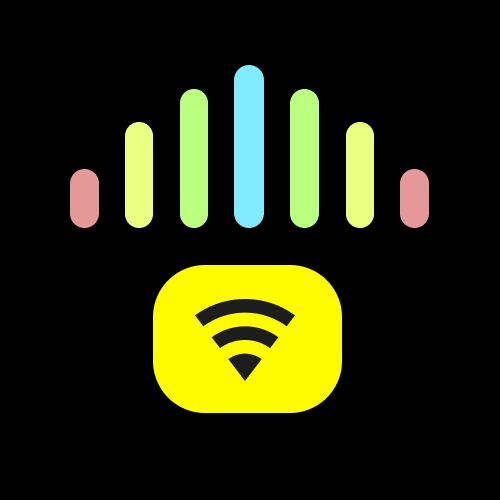
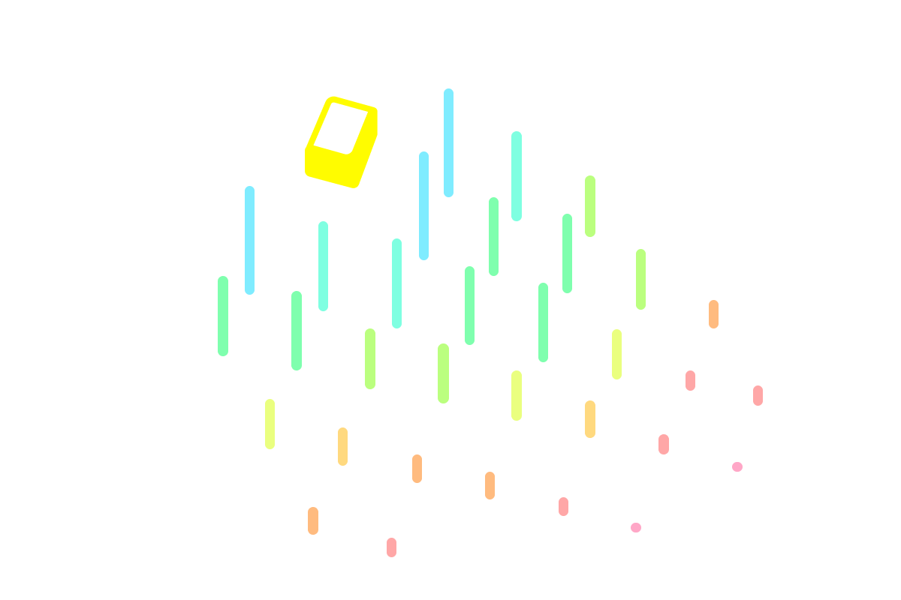
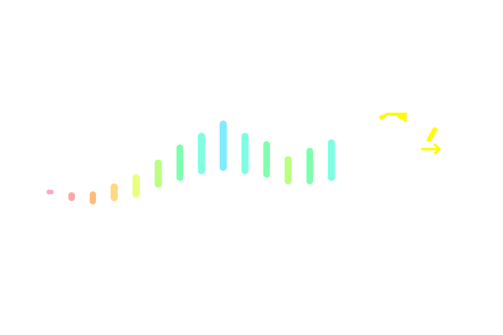
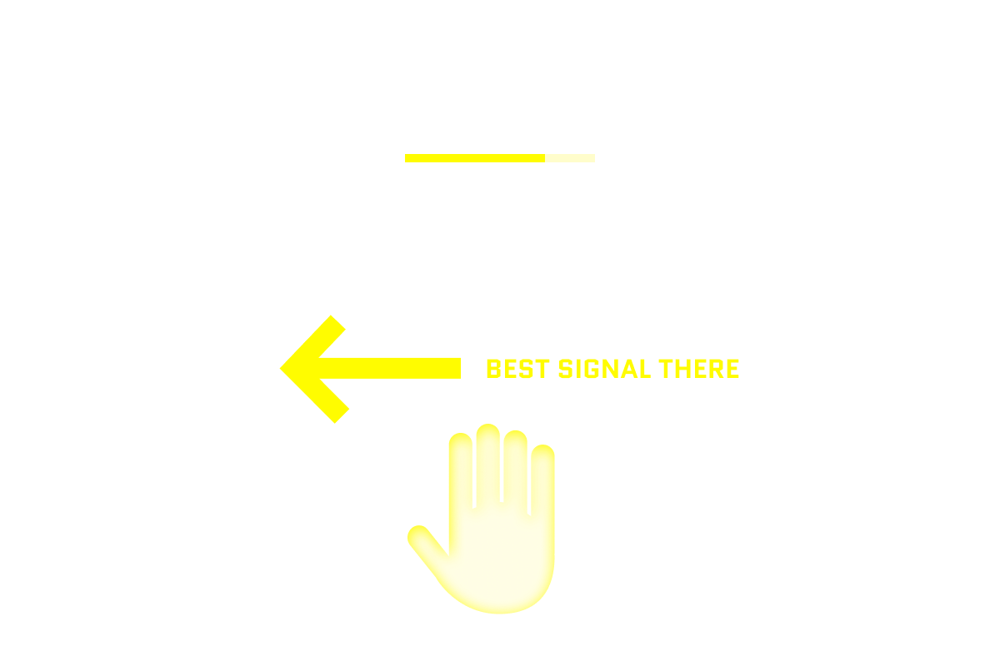
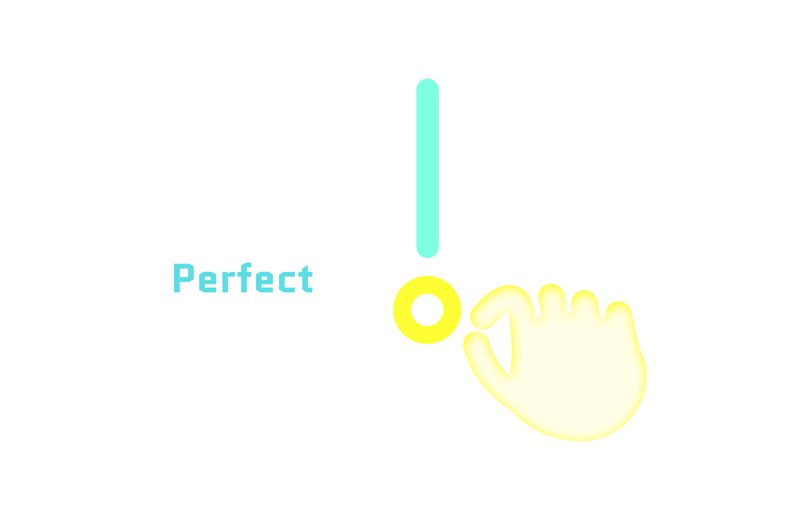

<div align="center">



# Wi-Fi Speed

**Snap Spectacles that map Wi-Fi coverage as you walk — probe, pin, and read signal quality from your palm.**

[](https://www.youtube.com/watch?v=72Gr3HF7yRA)
[](https://youtu.be/DLD1hkpAsLQ)
[](https://wifi.familybusiness.studio/)
[](https://ar.snap.com/lens-studio)

*Walk a space. See where download speed is good — and where it isn't.*

</div>

---

## Table of contents

- [Demo video](#demo-video)
- [Latest update](#latest-update)
- [Overview](#overview)
- [How it works](#how-it-works)
- [Web viewer](#web-viewer)
- [Project structure](#project-structure)
- [Main scripts](#main-scripts)
- [Tech stack](#tech-stack)
- [Getting started](#getting-started)
- [Run it locally](#run-it-locally)
- [Replace Snap Cloud project](#replace-snap-cloud-project)
- [License](#license)

---

## Demo video

<div align="center" id="demo-video">

[](https://www.youtube.com/watch?v=72Gr3HF7yRA)

[Watch the demo on YouTube](https://www.youtube.com/watch?v=72Gr3HF7yRA)

</div>

---

## Latest update

Publishing and web viewing were added so scans can be opened outside Spectacles with a six digit PIN.

<div align="center">

[](https://youtu.be/DLD1hkpAsLQ)

[Watch the publishing and web viewer update](https://youtu.be/DLD1hkpAsLQ)

</div>

---

## Overview

Wi-Fi Speed turns a Spectacles walkthrough into a **live coverage map**. As you move, the lens measures download speed and shows results as colored bars in your space — plus speed and quality on your left palm. Published scans can also be opened in a browser by PIN.

No laptop server. No manual logging. Just walk and read the map.

### Why

Phone speedtests give you one number at one spot. Wi-Fi actually varies by room, wall, and where you stand — but there's no simple way to *see* that in AR while you're moving.

This lens answers: *"Where in this space is download actually good?"*

### Features

- **Walk and map** — signal bars appear as you move through a space
- **Color-coded quality** — see good and weak spots at a glance
- **Left-palm UI** — latest speed, quality, and hints while you walk
- **Pinch for detail** — open a spot for Mbps, quality label, and record count
- **Web sharing** — publish a snapshot, open it with a six digit PIN, and inspect the 3D map in a browser
- **Onboarding** — short first-run tour (see [Getting started](#getting-started))

---

## How it works

```
┌──────────────────┐         ┌──────────────────┐
│  SPECTACLES      │ ──────► │  SNAP CLOUD      │
│  walk + probe    │  HTTPS  │  public storage  │
│  (Lens Studio)   │  fetch  │  speedtest/      │
└──────────────────┘         │  10mb.bin        │
         │                   └──────────────────┘
         ▼
┌──────────────────┐         ┌──────────────────┐
│  ON-DEVICE MAP   │ ──────► │  CLOUDFLARE      │
│  grid · pins ·   │ publish │  Pages + D1      │
│  palm UI         │  JSON   │  PIN viewer      │
└──────────────────┘         └──────────────────┘
```

1. **ConnectionProbe** resolves a download URL (Snap Cloud storage by default) and runs an HTTPS fetch with optional warmup + timed measure window.
2. **CoverageGridManager** records each good sample at a floor grid cell and spawns/updates a **Record** prefab pin.
3. Cell **weighted median** drives pin height, color bracket, and quality label via **CoverageMetrics**.
4. **CoveragePalmUi** shows probe progress, last Mbps, coaching hints, and an arrow toward stronger cells on the left palm.
5. Pinch a pin → **RecordMarker** detail panel (Mbps, session %, bracket, record count).
6. Optional publish sends a snapshot to the Cloudflare Pages API and returns a six digit PIN for browser viewing.

*Download speed is measured on-device (10 MB HTTPS file); results may differ from phone speedtest apps.*

---

## Web viewer

The browser viewer lives in [`web/`](web/) and is deployed at:

```text
https://wifi.familybusiness.studio/
```

Open a published map with:

```text
https://wifi.familybusiness.studio/?pin=123456
```

The viewer includes:

- Orthographic Three.js coverage bars with rotate, pan, zoom, reset, and view presets
- Direct vs inferred cells, hover/select states, and per-cell details
- Best / worst / average speed summary and scan age
- Weakest, strongest, and recorded-point navigation
- Shareable selected-cell links, for example `?pin=123456&cell=20,-40`
- Expiration status and an extend action for keeping a published map available

Published maps are stored as snapshot JSON in Cloudflare D1 and are accessed by PIN only.

---

## Project structure

```
Wi-Fi Speed/
├── README.md
├── LICENSE
├── AGENTS.md                 # brief agent context
├── docs/images/              # logo, onboarding screenshots for GitHub
├── web/                      # Cloudflare Pages viewer + D1 API
└── WiFi Speed/               # Lens Studio project
    ├── WiFi Speed.esproj
    ├── icon.png
    ├── testdata/             # 100kb.bin, 10mb.bin (upload 10mb.bin to Snap Cloud)
    ├── Assets/
    │   ├── Scene.scene
    │   ├── Record.prefab     # coverage pin (bar + pinch panel + VisualSphere)
    │   ├── Meshes/           # Cone, Cylinder, Sphere
    │   ├── Materials/        # bracket colors (0–10 … 90–100), UI mats
    │   ├── Images/           # onboarding PNGs + image materials
    │   ├── Scripts/          # TypeScript components (see below)
    │   └── SupabaseClient.lspkg
    └── Packages/
        ├── SpectaclesInteractionKit.lspkg
        ├── SpectaclesUIKit.lspkg
        └── Utilities.lspkg
```

Key scene objects: **`ConnectionProbe`**, **`CoverageGridManager`**, **`CoveragePalmUi`**, **`OnboardingController`**, **`SnapCloud`** (SnapCloudRequirements + SupabaseProject asset).

---

## Main scripts

All TypeScript lives in `WiFi Speed/Assets/Scripts/`.

| Script | Role |
|--------|------|
| **`ConnectionProbe.ts`** | Download speedtest loop. Resolves URL from **SnapCloudRequirements** (or `downloadUrl` override), runs ranged HTTPS fetch with warmup/measure windows, computes Mbps, discards samples if user moved too far (`maxTravelDistance`), forwards good samples to the grid. |
| **`CoverageGridManager.ts`** | Floor grid (`gridSize`), cell snapping, weighted median per cell, neighbor spread, FOV culling, spawns **Record** prefabs. Tracks session min/max Mbps for relative quality. |
| **`RecordMarker.ts`** | Per-pin behavior: bracket material + bar height from session %, pinch panel (header/secondary text), hover/select scale on **VisualSphere**, dead-zone warnings, registers with grid on update. |
| **`CoveragePalmUi.ts`** | Left-palm HUD: probe progress bar, status line, Mbps / session %, coaching hints (stay / move / retry), arrow toward best cells. Gates visibility on left palm pose. |
| **`CoverageMetrics.ts`** | Shared math: weighted median, session %, quality brackets (Good / OK / Poor), dead-zone detection, color helpers. No scene inputs — imported by other scripts. |
| **`SnapCloudRequirements.ts`** | Validates **SupabaseProject** asset, exposes `projectUrl` / tokens, builds public storage URLs for ConnectionProbe. |
| **`OnboardingController.ts`** | First-run slide tour (UIKit Frame + prev/next), persists dismiss in **PersistentStorage**, optional triggers tied to grid/palm events. |

Data flow:

```
ConnectionProbe → CoverageGridManager → RecordMarker (prefab instances)
        ↓                    ↓
  CoveragePalmUi      CoverageMetrics (shared)
```

---

## Tech stack

- **Platform** — Snap Spectacles, Lens Studio **5.15.4+**
- **Language** — TypeScript (`Assets/Scripts/`)
- **Hand / pinch UI** — Spectacles Interaction Kit (SIK)
- **Onboarding frame & buttons** — Spectacles UIKit (`Frame`, `RectangleButton`)
- **Speedtest file** — Snap Cloud public storage (`speedtest/10mb.bin`)
- **Mapping** — on-device grid + median smoothing (v1; no Postgres sync yet)
- **Web viewer** — Cloudflare Pages Functions, D1, Vite, Three.js

---

## Getting started

First launch shows a short onboarding flow. Four steps:

### 1. Map your space

The lens tests Wi‑Fi speed as you walk and shows signal strength in your space.

<div align="center">

</div>

### 2. Walk slowly

Slowly walk around to test your Wi‑Fi signal. Bars appear where probes succeed — taller and bluer means stronger download in your session.

<div align="center">

</div>

### 3. Open your palm

Turn your left palm toward you to see your latest speed and quality — progress while scanning, Mbps, session %, and hints.

<div align="center">

</div>

### 4. Pinch a bar

Pinch any bar to open details for that spot — Mbps, quality label, record count.

<div align="center">

</div>

Onboarding dismisses after the tour (stored on-device — won't show again unless reset).

---

## Run it locally

1. Clone this repo.
2. Open **`WiFi Speed/WiFi Speed.esproj`** in Lens Studio 5.
3. Set **Device Type Override → Spectacles** for preview.
4. **File → Send To → Spectacles** (or use device preview).
5. Walk — probes start automatically; open left palm for status.

The repo ships with a working Snap Cloud project wired in the scene. Clones can run as-is.

Forking or publishing your own build? See [Replace Snap Cloud project](#replace-snap-cloud-project).

---

## Replace Snap Cloud project

The lens downloads a test file from Snap Cloud storage to measure speed. To use **your own** project:

### 1. Create storage

In [Snap Cloud Console](https://kit.snapchat.com/manage/snap-cloud):

1. **Storage → New bucket** — name **`speedtest`**, enable **Public bucket**.
2. Upload **`WiFi Speed/testdata/10mb.bin`** (~10 MB).
3. **Policies** — allow public read (otherwise probes fail with **403**).

Browser check — this URL must download the file, not return 403:

```text
https://<your-project-ref>.snapcloud.dev/storage/v1/object/public/speedtest/10mb.bin
```

### 2. Import credentials in Lens Studio

1. **Window → Supabase** → log in → select your project → **Import Credentials**.
2. This creates a **SupabaseProject** asset under Assets.

### 3. Wire the scene

1. Select **`SnapCloud`** → **SnapCloudRequirements → Supabase Project** → your new asset.
2. On **`ConnectionProbe`**, confirm **Snap Cloud** points to `SnapCloud`, bucket **`speedtest`**, path **`10mb.bin`**, and **Download Url** is empty.
3. Save scene → preview on Spectacles.

**Alternative:** set **Download Url** on ConnectionProbe to any public HTTPS URL for a ~10 MB file.

---

## Publish and view maps on the web

The Lens can publish a coverage snapshot to the Cloudflare Pages backend. The backend stores it in D1 and returns a six digit PIN. Use the PIN in the web viewer to inspect or share the scan.

For deployment and local development details, see [`web/README.md`](web/README.md).

---

## License

[MIT](LICENSE) — Copyright (c) 2026 coob113
