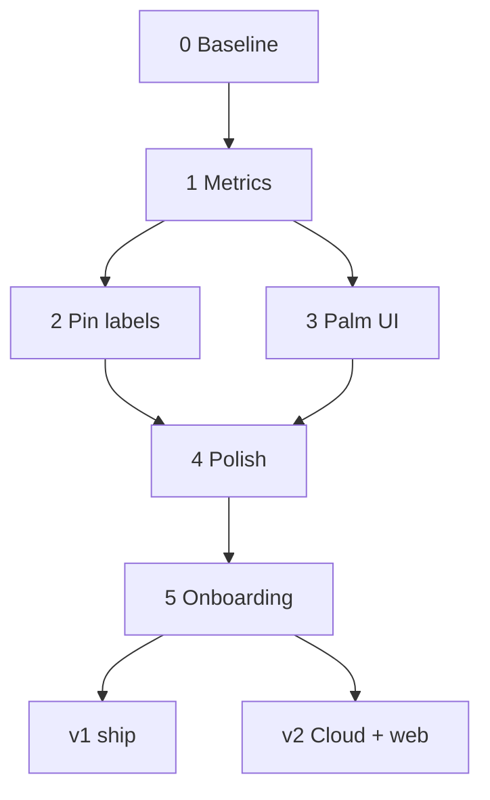

# Implementation architecture

Living plan for **InternetSpeed v1** (Spectacles lens): walk, probe, map coverage on-device.

**v2 (next major release):** Postgres schema, Snap Cloud sync, share pin, Cloudflare web viewer. Spec lives in [PHASE4](./PHASE4_SHARE_WEB.md) — not active work until v1 ships.

**Related:** [DesignNuances](./DesignNuances.md) · [PHASE3](./PHASE3_COVERAGE_GRID.md) · [FINDINGS](./FINDINGS_AND_NEXT_STEPS.md)

**Last updated:** 2026-05-20 (v1 ship — Stages 4–5 complete)

---

## How we work

- One stage at a time. **Pass the stage test** before starting the next.
- Keep each diff focused.
- Agent **stops and asks** when behavior is ambiguous, tests fail, wiring is needed, or infra needs your account.
- **Agent:** TypeScript, docs. **You:** Lens Inspector wiring, SIK, device tests.
- Match [Examples/Essentials](../../Examples/Essentials/README.md) for SIK / `@component` patterns; defer hookup to **`OnStartEvent`**.

---

## v1 scope

| In v1 | Deferred to v2 |
|-------|----------------|
| Polish lens UX (thresholds, debug cleanup, copy, hints) | Postgres schema + RLS |
| Onboarding (3 steps, dismiss + don’t show again) | Session sync + share pin on start |
| Pin labels + Palm UI (done) | Pin displayed on lens |
| Local-only mapping session | Web pin entry + raw list (7a) |
| | Web map grid (7b) |
| | Live HMD on web |

**Dropped / not planned:** expand pin panel to raw Mbps list on lens; Palm arrow “here” marker; separate Share button.

---

## Stage overview



| Stage | Name | Status | Completed |
|-------|------|--------|-----------|
| **0** | Baseline (probe + grid) | **Complete** | 2026-05 |
| **1** | Shared metrics | **Complete** | 2026-05-20 |
| **2** | Pin labels + dead zone | **Complete** | 2026-05-20 |
| **3** | Palm UI | **Complete** | 2026-05-20 |
| **4** | Polish | **Complete** | 2026-05-20 |
| **5** | Onboarding | **Complete** | 2026-05-20 |
| **v2** | Cloud + web | Future release | |

---

## Completed — Stages 0–3

Summary only; no further work unless polish stage touches these areas.

| Stage | Delivered |
|-------|-----------|
| **0** | `ConnectionProbe`, `CoverageGridManager`, `RecordMarker`, Snap Cloud 10 MB download, grid pins on ok samples — **measurement v2** (warmup window) |
| **1** | `CoverageMetrics.ts` — median, session %, brackets, dead zone; grid getters |
| **2** | Pin pinch panel (summary only), 10 bracket labels, `!` dead zone, inferred copy, VisualSphere hover/pinch |
| **3** | `CoveragePalmUi` — left palm, hysteresis, progress bar, last-ok metrics from `ConnectionProbe`, hints, arrow slerp |

**Key behavior (keep consistent in polish + onboarding copy):**

- **Palm UI** = last **ok probe** (Mbps, % vs ok-probe session range, bracket after ≥2 ok probes).
- **Pins** = cell **smoothed median** + history at that spot.
- Palm hints: stay / move / retry from grid sample count; stable text per type+cell.
- OK flash duration = `ConnectionProbe.interProbeDelaySec` (default 0.5 s).

Full Palm UI spec: [DesignNuances — Palm UI](./DesignNuances.md#palm-ui-always-on-while-mapping).

### Measurement v2 — warmup window (Stage A/B complete)

**Script:** `ConnectionProbe.ts` · **Detail:** [PHASE2_MINI_SPEEDTEST.md](./PHASE2_MINI_SPEEDTEST.md)

Per probe (defaults):

1. **Warmup** — `Range: bytes=0-2097151` (2 MB), discarded, not scored  
2. **Measure** — `Range: bytes=2097152-10239999` (~7.77 MB on `10mb.bin`), timed  

`Mbps = (measure_bytes × 8) / measure_seconds`

| Inspector | Default | Notes |
|-----------|---------|-------|
| `useByteRange` | `true` | Required for warmup |
| `useWarmupWindow` | `true` | Stage B |
| `warmupBytes` | `2097152` | 2 MB discard |
| `minMeasureBytes` | `4194304` | Fall back to full-file Range if window too small |
| `rangeFallbackToBulk` | `true` | One bulk GET if Range fails |
| `interProbeDelaySec` | `0.5` | Gap between probes; OK flash window |

**Device verified (2026-05-20):** 206 on warmup + measure; no ~17–19 Mbps cold-start dip (steady ~42–47 Mbps from first probe).

**Legacy:** `useWarmupWindow=false` → single full-file Range (Stage A). `useByteRange=false` → bulk GET.

Grid pins, Palm UI, and session % all consume the **scored measure Mbps** — no downstream code changes needed.

---

## Stage 4 — Polish

**Status:** Complete (2026-05-20)

**Depends on:** 0–3

Final lens pass before onboarding and v1 ship.

### Performance (implemented)

Central loop on **`CoverageGridManager`** — one `UpdateEvent` for all markers (per-marker `UpdateEvent` removed).

| Mechanism | Default | Notes |
|-----------|---------|-------|
| **FOV + distance cull** | `cullMaxDistance` 800 cm (8 m), `cullSphereRadius` 16 cm | `SceneObject.enabled = false` off-screen / too far |
| **Interactable disable** | `interactableMaxDistance` 100 cm (1 m) | `interactable.enabled = false` beyond pinch range |
| **Tiered visual sync** | near &lt; 200 cm; mid 200–400 cm / 200 ms; far &gt; 400 cm / 500 ms | Only when session min/max **changed** |
| **Staggered spawn** | 1 Record prefab / frame | Spread ring spawns queued after probe |
| **Uncull catch-up** | — | Re-enabled markers sync immediately |

Inspector: `perfNearDistance`, `perfMidDistance`, `perfMidUpdateSec`, `perfFarUpdateSec`, `cullCamera` (optional — falls back to Camera on `lookAtTarget`).

### Production tuning (locked for v1)

Verified in scene / prefab (2026-05-20):

| Input | Shipped value | Location |
|-------|---------------|----------|
| `RecordMarker.deadZoneMinSamples` | **3** | Record prefab |
| `RecordMarker.deadZoneSessionPct` | **1** | Script default (Inspector-serialized) |
| `CoveragePalmUi.moveAfterSamples` | **3** | CoveragePalmUi in scene |
| `qualityLabel` cutoffs (`CoverageMetrics`) | **70 / 35** | Code constants — Good ≥70%, OK ≥35% |
| `deadZoneMbps` / `sessionSpreadMinMbps` | **10 / 5** | `CoverageMetrics` defaults |

### Debug / cleanup (complete)

- [x] `ConnectionProbe`: `debugText` removed; routine logs gated behind `logMeasurementDetail` (off in scene)
- [x] No `DebugText` object in scene (verified)
- [x] `CoverageGridManager`: `logSessionRange`, `debugCullStats` inputs removed
- [x] `SnapCloudRequirements`: startup banner removed; `log()` gated behind `enableDebugLogs` (script default off)
- [x] Remaining `print()` — errors only, or explicit debug flags

**Inspector overrides to check before release build:**

| Component | Input | Scene value | Note |
|-----------|-------|-------------|------|
| SnapCloudRequirements | `enableDebugLogs` | **true** | Set **false** for quiet Logger |
| OnboardingController | `forceShowOnboarding` | **true** | Set **false** so dismiss persists |

### UX polish (complete)

- [x] Copy / visual pass on pin panel + palm UI
- [x] `!` Limit Icon on bar (sibling to detail panel — visible without pinch)
- [x] Contextual one-time hints — **skipped** (onboarding covers basics)
- [x] Optional Help screen — **skipped**

### Regression (complete)

- [x] Device checklist: probe loop, pins, palm UI, pinch panels

---

## Stage 5 — Onboarding

**Status:** Complete (2026-05-20)

**Depends on:** 4

### Scope

5 slides + UIKit Frame (Close dismisses permanently):

| Slide | Header | Auto-advance |
|-------|--------|--------------|
| 1 | The Speed | 15 s timer or Next |
| 2 | Walk and measure | 30 new bars since slide enabled, or Next |
| 3 | Check your palm | Palm UI becomes visible, or Next |
| 4 | Touch the signal | First pinch opens pin detail, or Next |
| 5 | Have fun! | 5 s timer → dismiss |

Step label: script-owned `Step N/5`. Previous hidden on slide 1. Next always visible (dismisses on last slide). Persistence: `internet_speed_onboarding_dismissed_v1` via `global.persistentStorageSystem`.

### Implementation

- **`OnboardingController.ts`** — slide visibility, nav, auto-advance, persistence
- Hooks: `CoverageGridManager.getMarkerCount()`, `CoveragePalmUi.isPalmUiVisible()`, `RecordMarker.subscribeDetailOpened()`

### Wiring (verified in scene)

All inputs wired: `slides[5]`, `stepText`, `prevButtonObject`, `frame`, `prevButton`, `nextButton`, `grid`, `palmUi`.

### Test (complete)

- [x] First launch → 5 steps → dismiss
- [x] Don’t show again → skip on next launch (requires `forceShowOnboarding=false`)
- [x] Probes run after dismiss (non-blocking)

---

## v2 — Cloud + web (future release)

Not in v1 scope. When v1 is done, pick up in this order (see [PHASE4](./PHASE4_SHARE_WEB.md)):

| Step | Work |
|------|------|
| Schema | `supabase/migrations/001_coverage.sql`, RLS, `DatabaseTypes.ts` |
| Lens sync | `CoverageSessionSync.ts` — pin on session start, flush every ok sample |
| Pin on lens | Show `share_pin` in HUD / persistent Text |
| Web 7a | Pin entry + raw sample list (no map) |
| Web 7b | 2D grid map, origin, cell detail |
| Deploy | Cloudflare Pages + GitHub + custom domain (you) |
| Optional | Live HMD pose on web map |

**Locked for v2 (don’t redo when we start):** pin generated at session start (not Share tap); sync every record batched; web 7a before 7b; same smoothing rules on web as lens.

---

## Wiring checklist (Lens Studio)

| Component | Wire to |
|-----------|---------|
| ConnectionProbe | snapCloud, coverageGrid, positionSource, audio, interProbeDelaySec, useByteRange, useWarmupWindow, warmupBytes |
| CoverageGridManager | recordPrefab, recordsParent, lookAtTarget |
| RecordMarker (prefab) | interactable, visualSphere, detailPanel, headerText, secondaryText, limitIcon, bracketLabels, colorTarget, scaleTarget, bracketMaterials |
| CoveragePalmUi | probe, grid, positionSource, palmAttachPoint, scaleRoot, statusText → **CurrentStatus**, progressBarPivot, progressBarBackground, headerText, secondaryText, hintText, arrowObject |
| OnboardingController | slides[5], stepText, prev/next buttons, frame, grid, palmUi |

**Preview:** Spectacles override. **Validate on device** for network + interaction.

---

## Decisions locked

| Topic | Decision |
|-------|----------|
| v1 ship scope | Lens only — polish + onboarding (**shipped**) |
| Palm vs pins | Last ok probe vs cell smoothed median |
| Pin detail on lens | Summary only — **no expand list** |
| Lens / SIK | [Examples/Essentials](../../Examples/Essentials/README.md) |
| Download Mbps | **Warmup window** — score measure Range only; 2 MB warmup default ([PHASE2](./PHASE2_MINI_SPEEDTEST.md)) |
| Agent vs you wiring | [FINDINGS](./FINDINGS_AND_NEXT_STEPS.md) pattern |

---

## v1 tuning (locked)

| Input | Value | Notes |
|-------|-------|-------|
| Good / OK / Poor cutoffs | 70 / 35 | `CoverageMetrics` constants |
| `moveAfterSamples` | 3 | Palm “move on” hint threshold |
| `deadZoneMinSamples` | 3 | Record prefab |
| `deadZoneSessionPct` | 1 | Bottom 1% of session (when spread ≥ 5 Mbps) |
| `!` icon | On bar | Visible without opening pinch panel |

---

## File map

```
InternetSpeed/
  Assets/Scripts/
    ConnectionProbe.ts
    CoverageGridManager.ts
    RecordMarker.ts
    SnapCloudRequirements.ts
    CoverageMetrics.ts
    CoveragePalmUi.ts
    OnboardingController.ts      # Stage 5
  docs/
    IMPLEMENTATION_ARCHITECTURE.md
    DesignNuances.md
    PHASE4_SHARE_WEB.md          # v2 web + schema spec
```

---

## Changelog

| Date | Change |
|------|--------|
| 2026-05-20 | **v1 ship** — Stages 4–5 complete; debug cleanup; production tuning locked |
| 2026-05-20 | **Measurement v2** — HTTP Range warmup window (Stage A/B); device verified |
| 2026-05-20 | **Plan reordered:** v1 = Stages 4–5 (polish, onboarding); cloud/web → v2; doc trimmed; completed 0–3 collapsed |
| 2026-05-20 | Stage 3 complete — Palm UI device-tested |
| 2026-05-20 | Stages 1–2 complete |
| 2026-05-20 | Initial architecture doc |
