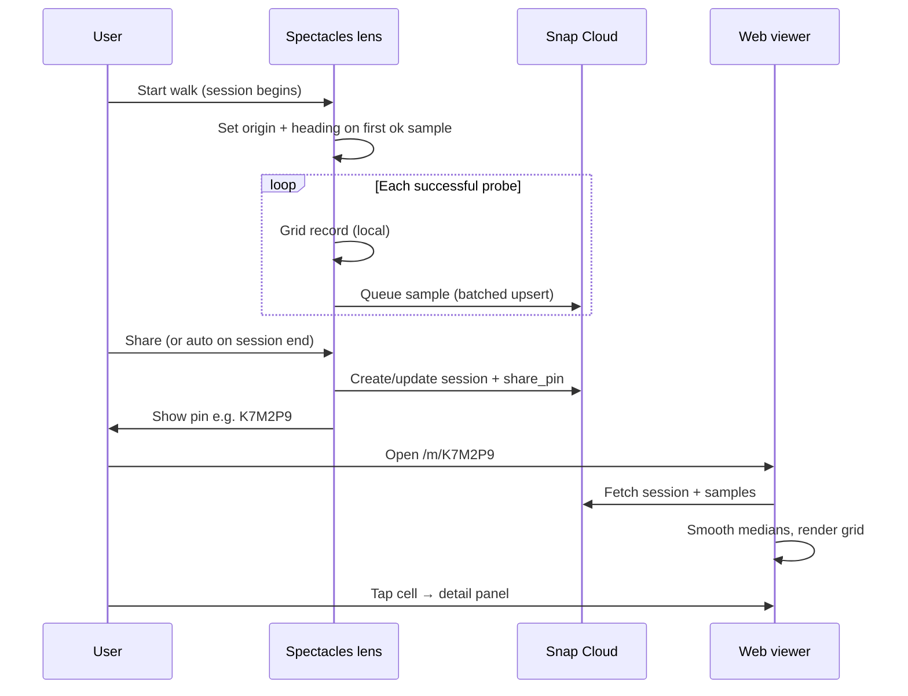

# Phase 4: Share coverage via Snap Cloud + web viewer

Publish a walked coverage map to Snap Cloud (Supabase), open it on a website with a **share pin**, and tap cells for the same detail as in-lens pins.

**Status:** Planned — schema and lens hooks should land **before** the web app so data shape stays stable.

**Depends on:** [PHASE3_COVERAGE_GRID.md](./PHASE3_COVERAGE_GRID.md), [PHASE1_SNAP_CLOUD.md](./PHASE1_SNAP_CLOUD.md), [DesignNuances.md](./DesignNuances.md)

**Prior art:** World Kindness Day — lens writes Supabase → companion web reads it (same Snap Cloud pattern).

---

## Goals

| Goal | Priority |
|------|----------|
| Share map via short **pin** or URL | Must have |
| Web 2D grid with **origin** marked | Must have |
| Grid oriented so **forward at origin points up**; fit to viewport; **zoom / pan** | Must have |
| Tap cell → Mbps, session %, Good/OK/Poor, records list, dead zone `!` | Must have |
| Incremental sample upload from lens (batched) | Must have |
| **Live HMD position + rotation** on web | Future (nice to have) |
| Supabase Realtime for samples | Optional (batch refresh is fine for v1) |

---

## End-to-end flow



### Lens-side (incremental, start early)

1. **Session start** — generate `session_id` (UUID) in memory; no UI required yet.
2. **First successful probe** — lock **origin** `(origin_x, origin_z)` and **origin_yaw** (HMD yaw on XZ plane).
3. **Each ok sample** — append to local grid (unchanged) **and** queue row for `coverage_samples`.
4. **Batch flush** — every N seconds or every M samples, `POST`/`upsert` to Supabase (do not block the 10 MB download loop).
5. **Share** — ensure session row exists with `share_pin`; show pin on lens; mark `status = sharing`.

Auth: Snap `signInWithIdToken` (see `Examples/Snap Cloud/.../TableConnector.ts`, WKD `KindnessCounter.ts`).

### Web-side

1. User enters pin or opens `/m/{pin}`.
2. Load `coverage_sessions` + all `coverage_samples` for that session.
3. Recompute cell medians + neighbor smoothing (same rules as `CoverageGridManager`).
4. Render 2D grid; draw **origin**; apply rotation + fit + zoom.
5. Tap cell → detail panel (copy from [DesignNuances.md](./DesignNuances.md)).

---

## Web grid: origin, orientation, viewport

### Coordinate frame (must match lens)

| Concept | Lens (world) | Web (2D map) |
|---------|--------------|--------------|
| Floor plane | XZ | Screen X/Y |
| Up | +Y | N/A (top-down map) |
| Grid snap | `round(axis / grid_size) * grid_size` | Same `cell_x`, `cell_z` from DB |
| Origin | Session start position on XZ | Marker at `(0, 0)` after transform |

Store **world** `cell_x`, `cell_z` in the database (same as `RecordMarker` / `CoverageGridManager`). The web app transforms into view space; do not store only grid indices until origin is fixed.

### Orientation: “origin looking upward”

At session start, record **origin_yaw** — HMD forward projected onto XZ (radians, 0 = world +Z or project convention — document once and use consistently).

For each cell:

1. `dx = cell_x - origin_x`, `dz = cell_z - origin_z`
2. Rotate by `-origin_yaw` so **forward at origin → top of screen** (+screen Y):

```
map_x =  dx * cos(yaw) + dz * sin(yaw)
map_y = -dx * sin(yaw) + dz * cos(yaw)
```

3. Scale `map_x`, `map_y` into pixels (see fit/zoom below).

**Origin marker:** distinct glyph at `(0, 0)` after step 2 (e.g. circle + small arrow along +map_y = “you started here, facing up”).

### Fit to window + zoom / pan

- **Initial fit:** bounding box of all cells (in map space) ∪ origin; pad ~10%; scale uniformly into viewport (`object-fit: contain` behavior).
- **Zoom:** wheel / pinch / +/- controls; zoom toward cursor or viewport center.
- **Pan:** drag when zoomed in.
- **Reset:** button to re-fit all cells + origin.

Cell hit-testing: inverse transform (screen → map space → nearest `cell_x`, `cell_z` or snap to grid).

### Cell visuals (parity with lens)

| Visual | Rule |
|--------|------|
| Color | 10 brackets from session % (smoothed median) |
| Size | Larger if `has_own_recording`; smaller if neighbor-inferred only |
| Dead zone | `!` when [DesignNuances](./DesignNuances.md) rules met |
| Detail panel | Median Mbps, %, label, record count, expandable raw `mbps[]` |

---

## Database schema (design now, migrate early)

Design for **raw samples** + **session metadata**. Web (or edge function) aggregates medians and smoothing — keeps lens uploads simple and viewer authoritative for shared maps.

### `coverage_sessions`

| Column | Type | Notes |
|--------|------|--------|
| `id` | `uuid` PK | Generated on lens at session start |
| `share_pin` | `text` UNIQUE | 6–8 chars, e.g. `K7M2P9`; null until Share |
| `created_at` | `timestamptz` | |
| `updated_at` | `timestamptz` | Bump on sample batch |
| `status` | `text` | `draft` \| `sharing` \| `archived` |
| `title` | `text` nullable | Optional user label |
| `grid_size` | `float` | Default `10`; must match lens |
| `origin_x` | `float` | World X at session origin |
| `origin_z` | `float` | World Z at session origin |
| `origin_yaw` | `float` | Radians; HMD forward on XZ at origin |
| `neighbor_influence` | `float` | Default `0.4`; for web smoothing parity |
| `smooth_passes` | `int` | Default `2` |
| `session_min_mbps` | `float` nullable | Cached after smoothing recompute |
| `session_max_mbps` | `float` nullable | Cached |
| `created_by` | `uuid` nullable | Supabase user id from lens auth |
| `expires_at` | `timestamptz` nullable | Optional TTL for shared links |

**Future (live HMD — not v1):** optional columns or separate table below.

### `coverage_samples`

| Column | Type | Notes |
|--------|------|--------|
| `id` | `uuid` PK | Client-generated or DB default |
| `session_id` | `uuid` FK → `coverage_sessions` | |
| `cell_x` | `float` | Snapped world X |
| `cell_z` | `float` | Snapped world Z |
| `mbps` | `float` | Successful probe only in v1 |
| `is_direct` | `boolean` | `true` = own cell; `false` = neighbor spread |
| `recorded_at` | `timestamptz` | Probe finish time |
| `world_x` | `float` nullable | Optional probe midpoint X |
| `world_z` | `float` nullable | Optional probe midpoint Z |

**Indexes:** `(session_id)`, `(session_id, cell_x, cell_z)`.

**Unique constraint (optional):** none on samples — multiple probes per cell are expected.

**Later columns:** `probe_status` (`ok` \| `moved` \| `fail`), `duration_ms`, `bytes_received`.

### Future: live HMD telemetry

Not required for share + static grid. When added:

**Option A — single row on session (simplest for Realtime):**

| Column | Type | Notes |
|--------|------|--------|
| `hmd_x`, `hmd_y`, `hmd_z` | `float` | Latest world position |
| `hmd_yaw` | `float` | Latest yaw on XZ |
| `hmd_updated_at` | `timestamptz` | |

Lens updates every 0.2–0.5 s while session active; web subscribes via Realtime and draws a **head icon** on the map (same rotation transform as cells).

**Option B — time series table** `coverage_hmd_samples` if playback/history is needed (defer).

### RLS (sketch)

| Role | `coverage_sessions` | `coverage_samples` |
|------|---------------------|---------------------|
| Authenticated lens user | INSERT/UPDATE own rows (`created_by = auth.uid()`) | INSERT for own `session_id` |
| Anon / web reader | SELECT where `share_pin` is not null and `status = sharing'` | SELECT via session join |

Pin is the capability URL — use unguessable pins; optional `expires_at`.

Regenerate `Assets/DatabaseTypes.ts` after SQL migration (Supabase plugin).

---

## Lens changes (start before web app)

Minimal hooks so schema stays stable:

| Change | Where | When |
|--------|--------|------|
| Session UUID + origin + yaw on first ok sample | New `CoverageSessionSync.ts` or extend `ConnectionProbe` | Early |
| Queue `{ session_id, cell_x, cell_z, mbps, is_direct, recorded_at }` | After `coverageGrid.recordSample` | Early |
| Batch upload via Supabase client | Same module; timer-based flush | Early |
| `share_pin` + session row upsert | Share action / UI | Before web MVP |
| Pass `grid_size`, smoothing params on session create | `CoverageGridManager` inputs | Early |

Do **not** block probes on upload failure — log and retry queue.

---

## Web app (later milestone)

| Piece | Suggestion |
|-------|------------|
| Stack | Vite + React (or Next) + `@supabase/supabase-js` |
| Route | `/m/:pin` |
| Smoothing | Port `buildSmoothedMedianMap` logic from `CoverageGridManager.ts` |
| Detail UI | Match [DesignNuances.md](./DesignNuances.md) three-line + expand |
| Deploy | Snap Cloud static host, Cloudflare Pages, or Vercel with anon key |

v1 refresh: load on open + manual refresh button. Realtime subscription on `coverage_samples` is optional.

---

## Future: live HMD on web map

**Cool, not must-have.**

- Lens publishes throttled HMD pose to `coverage_sessions` (Option A) or Realtime channel.
- Web shows moving dot + facing wedge on the same rotated grid as cells.
- Same `origin_yaw` transform applies to HMD `(x, z)`.
- Privacy: only while session is `sharing` and user opted in; stop updates on session end.

Reference: `Examples/Snap Cloud/.../RealtimeCursor.ts` for Realtime channel patterns.

---

## MVP vs later

| Milestone | Deliverable |
|-----------|-------------|
| **4a — Schema + lens queue** | SQL tables, RLS, origin/yaw/samples upload, no web |
| **4b — Share pin** | Lens UI shows pin; session `status = sharing` |
| **4c — Web viewer** | Grid, origin, orient, fit, zoom, tap detail |
| **4d — Polish** | Dead zone `!`, inferred cell styling, expiry |
| **4e — Live HMD** | Throttled pose + Realtime overlay on web |

**Fast fallback (debug only):** export `coverage/{pin}.json` to Storage on Share — web reads JSON. Skip for product path if Postgres is ready.

---

## Open questions

- [ ] Pin length and charset (avoid ambiguous `0`/`O`)
- [ ] Auto-share on session end vs explicit Share button
- [ ] World +Z vs device forward for `origin_yaw` sign convention — lock in lens + web together
- [ ] Regenerate medians on web only vs occasional lens-side `session_min/max` cache update
- [ ] Whether failed/moved probes are stored for transparency (schema ready: `probe_status`)

---

## Related docs

- [DesignNuances.md](./DesignNuances.md) — pin labels, dead zone, HUD (HUD stays lens-only)
- [FINDINGS_AND_NEXT_STEPS.md](./FINDINGS_AND_NEXT_STEPS.md) — Step 4 export (superseded by this phase for Snap Cloud path)
